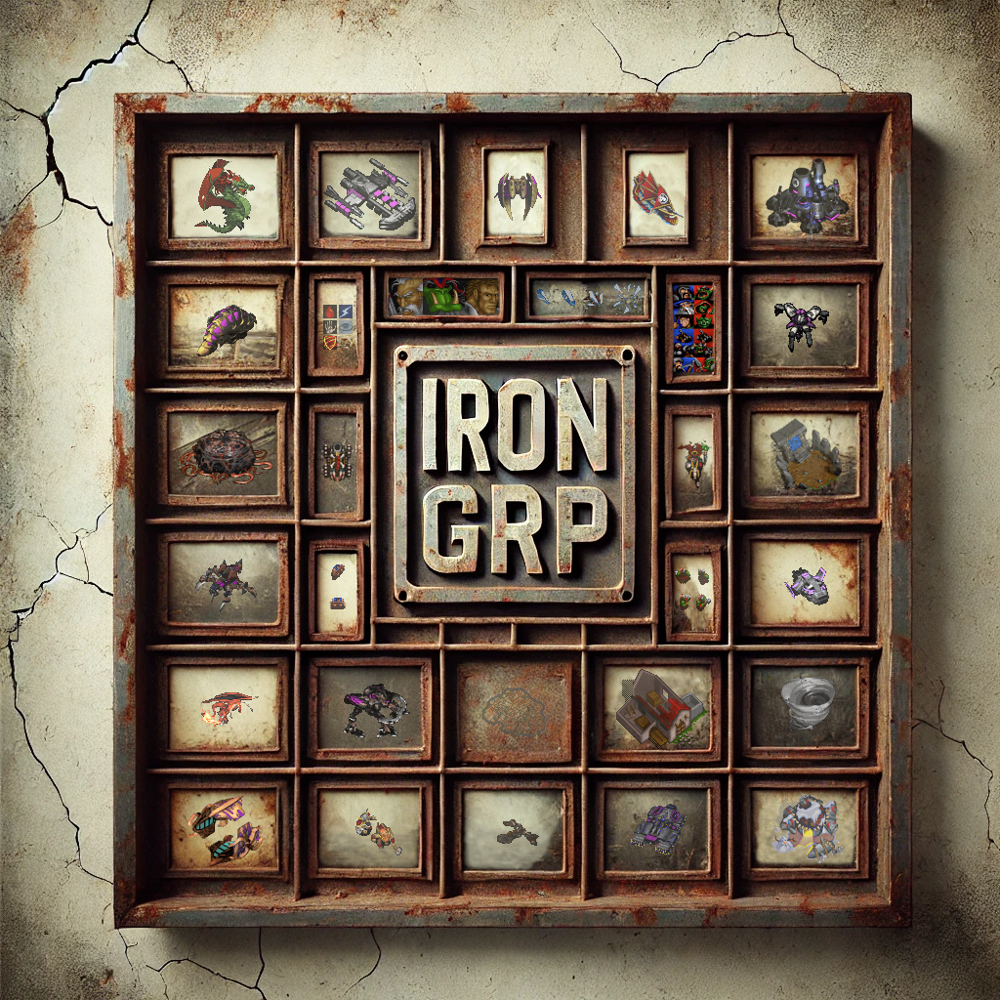

# IronGRP
A Rust command-line utility to convert between GRP sprite files and PNG images. GRP files contain the unit and building sprites used by StarCraft, WarCraft I, and WarCraft II. For a utility that handles the sprites used by StarCraft: Remastered, see [animosity](https://github.com/neivv/animosity).



## 📦 Features
- ✅ Extracting image data from a GRP file to PNGs
- ✅ Extracting all frames (default) or only a given frame
- ✅ Tiling multiple frames into a single PNG (sprite sheet)
- ✅ Converting PNGs back to GRP
- ✅ Can read and create Uncompressed GRPs, and Uncompressed GRPs with extended frame widths (up to 512 pixels)
- ✅ Can decode all GRPs to PNGs and back to GRPs and create byte-per-byte identical results as the input, for all GRPs from StarCraft, StarCraft: Brood War, WarCraft II: Battle.net Edition and WarCraft I: Orcs & Humans.
- ✅ Deduplicating identical frames when encoding
- ✅ Analysing GRP files for internal gaps, overlaps, and data reuse


## 🚀 Usage

### Extract PNGs from a GRP file
```bash
irongrp \
  --mode grp-to-png \
  --input-path unit/terran/marine.grp \
  --pal-path units.pal \
  --output-path marine2000/
```

### Extract PNGs from a GRP file, with a transparent (rather than black) background
```bash
irongrp \
  --mode grp-to-png \
  --use-transparency \
  --input-path unit/terran/marine.grp \
  --pal-path units.pal \
  --output-path marine2000/
```

### Extract a single frame to PNG from a GRP file
```bash
irongrp \
  --mode grp-to-png \
  --frame-number 71 \
  --input-path unit/terran/marine.grp \
  --pal-path units.pal \
  --output-path marine2000/
```

### Tile all frames into one image
```bash
irongrp \
  --mode grp-to-png \
  --input-path unit/terran/marine.grp \
  --pal-path units.pal \
  --output-path marine2000/ \
  --tiled \
  --max-width 300
```

### Convert PNGs back to GRP
```bash
irongrp \
  --mode png-to-grp \
  --input-path marine2000/ \
  --pal-path units.pal \
  --output-path marine2000/new-grp.grp
```

Note that this mode will convert *all* PNGs, alphabetically sorted, in the given directory. Before running the command, the user needs to make sure the directory only contains the intended PNGs, and that they are named in a way that corresponds with the intended order of frames in the GRP.

### Convert PNGs to Uncompressed GRP
```bash
irongrp \
  --mode png-to-grp \
  --compression-type uncompressed \
  --log-level debug \
  --input-path dlgs/ \
  --pal-path dialog.pal \
  --output-path dlgs/protoss.grp
```

This will create an Uncompressed GRP rather than a normal, RLE compressed GRP. Detailed logging is used, since the `log-level` is set to `debug`.

### Analyse GRP structure
```bash
irongrp \
  --mode analyse-grp \
  --input-path unit/terran/marine.grp
```

### Analyse a given row of a given frame of a GRP
```bash
irongrp \
  --mode analyse-grp \
  --log-level debug
  --frame-number 71 \
  --analyse-row-number 15 \
  --input-path unit/terran/marine.grp
```

### Compiling

```bash
cargo build --release
```

This will create a binary in the `target/release` directory.

### Testing

Run unit and property tests:

```bash
cargo test
```


## 🧩 Command-Line Options
| Flag                   | Description                                                                                                            |
|------------------------|------------------------------------------------------------------------------------------------------------------------|
| `--mode`               | Which operation to perform: `grp-to-png`, `png-to-grp`, or `analyse-grp` (default: `grp-to-png`)                       |
| `--input-path`         | Path to the .grp file to convert to .png files or to analyse, or to the directory with .png to convert to .grp         |
| `--pal-path`           | Path to the palette file. Will use greyscale palette if argument is not given.                                         |
| `--output-path`        | Path to the directory in which the .pngs will be created, or to the .grp file to write to                              |
| `--tiled`              | Output one tiled .png containing all frames. It is not possible to create a .grp back from this                        |
| `--max-width`          | If creating a tiled .png, this is the maximum width of the tiled image in pixels                                       |
| `--use-transparency`   | Creates .png with transparent background instead of using the colour in palette index 0                                |
| `--frame-number`       | Will only output or analyse the specified frame number (0-indexed)                                                     |
| `--analyse-row-number` | Will print the image data of the given row number (0-indexed) to stdout. Only applicable in `analyse-grp` mode         |
| `--log-level`          | How much information to print out during operation. Allowed values: trace, debug, info, warn, or error (default: info) |


## 🗜️ Compression

The GRP format of StarCraft and WarCraft II has support for Run-Length Encoding (RLE) compression, in order to save space. Most GRPs (including all units and building sprites) use RLE compression, but there are a few instances where the GRPs are Uncompressed. All WarCraft I GRPs are uncompressed, and in addition use a slightly different format (The maximum width and height of the frames are stored in one byte in the WarCraft I format, instead of 2 for the latter games).

The games do not automatically detect the format, so in order to modify compressed GRP files, the replacement must be kept compressed and uncompressed GRP files must be kept uncompressed.

The compression type can be explicitly specified using the `--compression-type` parameter. By setting the parameter to `normal`, IronGRP will create RLE Compressed GRPs, and Uncompressed GRPs can be created by setting the parameter to `uncompressed`. WarCraft I style GRPs can be created by setting the parameter to `war1`.

If a GRP is Uncompressed, IronGRP will print that out, and in addition name the PNGs "uncompressed_frame_xxx.png". When converting back to GRP, if no explicit compression type was given using the `--compression-type` parameter, or if the given type was `auto`, then the resulting GRP will be uncompressed if any of the PNG files contain "uncompressed" in its filename; and if not, the GRP will have normal compression. The same is the case for WarCraft I GRPs; they will be named "war1_frame_xxx.png", and if the `--compression-type` is `auto` or omitted, the GRPs will be of WarCraft I style if any of the input PNGs contains "war1".

### Technical nuances

As a normal user, you don't need to be concerned with the following details, but for the technically curious:

Both the RLE Compressed variant and the Uncompressed variant come in different flavours.

* **RLE Compressed**: In the RLE compression of Normal GRPs, a control byte is used to set one of three command types: one being that the next x pixels are transparent; one being that the next x pixels are identical; one being to copy the next x pixels, which can be different. So if there were eight identical pixels in a row, the command byte would signal identicality, and the next byte would be the pixel value. This thus saves 8–2 = 6 bytes of space. Normally, four pixels must be identical for this instruction to be used, and this is the threshold that the `--compression-type=normal` sets. However, in one single instance - the Orc Blacksmith from WarCraft II - a different more efficient threshold of three pixels is used. As this saves more space than the normal threshold of four pixels, it is unclear why this is not the standard. This more efficient mode can be used by giving the parameter `--compression-type=optimised`. The games should have no problem using either, so it is up to the user whether they want the Blizzard standard way (used for every RLE Compressed GRP except the Orc Blacksmith), or a slightly more efficient way.
* **Uncompressed**: GRPs only allow for frames to be up to 255x255 pixels. GRPs have an offset to the image data of each frame. However, in WarCraft II, Blizzard used a little trick to extend the image size. By setting the high bit of the offset, that signals that the width of the frame is between 256 and 512 pixels. IronGRP can convert from and create such Extended Uncompressed GRPs, and will do so automatically if a frame has a width between 255 and 512 pixels.
* **War1**: The GRP format originates from WarCraft I. It does not support RLE compression. There is a minor difference between WarCraft I GRPs and the Uncompressed GRPs of WarCraft II and StarCraft: the WarCraft I GRPs have a header section that is two bytes smaller than the later games. The header stores the frame count as a two-byte value, followed by the maximum width and maximum height. The max width and height are one-byte values in WarCraft I GRPs, but two-byte values in WarCraft II and StarCraft.

## 🕵️ Analysis Mode

IronGRP supports an analysis mode, activated by the parameter `--mode=analyse-grp`, which will inspect the structure of GRP files:

- Prints out and validates header information
- Detects unused "gap" regions
- Reports overlapping offsets
- Finds duplicate frames
- Visualises file layout in the terminal


## 🎨 How GRP Files Handle Colour

GRP files do not store actual RGB colours. Instead, each pixel is represented by a single byte — a number between 0 and 255. This number is a palette index, pointing to a colour in an external .pal (palette) file. The file path to a palette file must be provided to IronGRP, so that colour conversion can happen correctly. If no palette file is provided, IronGRP will fall back to a greyscale palette.

GRP Format:
- Stores palette indices only
- Assumes you have a palette file (.pal) containing 256 colours
- Each palette entry is an [R, G, B] triple — 3 bytes × 256 = 768 bytes total

So when you extract a GRP into PNGs:
- Each pixel's index (e.g. 71) is looked up in the palette
- That gives the actual RGB colour to use in the PNG: e.g. [68, 220, 63]

When converting a PNG into a GRP:
- Each pixel's RGB colour is compared to the palette
- The closest match is selected
- The resulting GRP contains only the palette indices, not the RGB colours

Palette index 0 (which is black in the standard palette) is treated as transparent in StarCraft. If the PNG files to be converted to GRP contain colours not present in the palette, IronGRP will attempt to find the closest match but warn about a non-exact colour.

Many image editors have support for palettes. By loading the right palette when editing the frames in the image editor, you make sure the colours of edited PNGs won't deviate from what is representable in the game. See, for example, the [documentation for GIMP](https://docs.gimp.org/3.0/en/gimp-concepts-palettes.html).


## 🪟 Transparency: PNG vs GRP

PNG images support full per-pixel alpha transparency, meaning each pixel can be fully opaque, fully transparent, or partially transparent (e.g. 50%).

GRP files do not support alpha transparency at all.

Instead:
- GRPs use a single palette index (0) to represent transparency.
- Any other index is treated as fully opaque.

### What This Means When Converting PNG → GRP

If your input PNG contains semi-transparent pixels (alpha between 1 and 254):

- These cannot be accurately represented in a GRP.
- IronGRP will attempt to map the RGB colour, ignoring the alpha value.
- This may result in visible differences in the output (e.g. halos or soft edges turning into solid pixels).

Fully transparent pixels (alpha = 0) are supported and will be safely converted to palette index 0, which is treated as transparent in GRPs. However, there is no difference between a fully transparent pixel (alpha = 0) and a completely black pixel, since both would translate to palette index 0 in the standard palette.

### ℹ️ Recommendation

To get the best results:
- ✅ Use PNGs with either fully opaque or fully transparent pixels.
- ❌ Avoid partial/translucent alpha blending — it won't translate well to GRP.
- ✅ When in doubt, flatten or threshold the transparency before converting.

## Integrations

Some integrations between IronGRP and other software are in the `integrations` directory, see [here](integrations/README.md).
